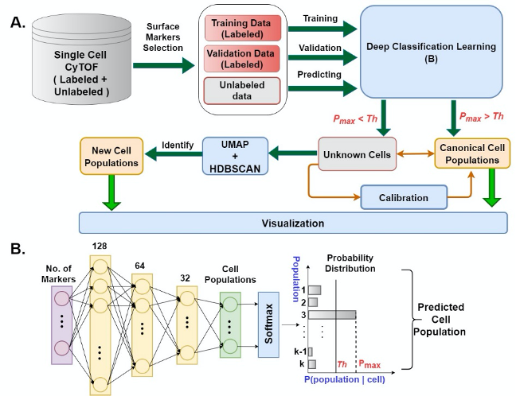

# DGCyTOF



## API Link [here](https://github.com/lijcheng12/DGCyTOF/blob/main/DGCyTOF_Package/docs/API.md)

## What is DGCyTOF
A new tool Deep learning with Graphical clustering for CyTOF, called DGCyTOF, is developed to identify cell populations. The method novelty is to distinguish the calibration cell population and the new cell population by a sequential four steps with an iteration calibration system. 

First, deep classification learning is constructed to identify the calibration cell population by the SoftMax classification assignment. These unknown types of cells will be filtered by the probability threshold from all cells. 

Second, an embedding graphical clustering is used to identify the new cell populations by structure clustering sequentially. The embedding graphical clustering simultaneously learns feature representations while preserving data structure in a cell-cell interaction network for cluster assignments. 

Third, in the middle of layer, an iteration calibration system is used to adjust the cell populations between the new and the unknown cell populations. The iteration calibration system will automatically adjust to the classification and the clustering by a feedback loop to reduce cell type identification error rate. 

Finally, a 3-dimension (3D) visualization platform is developed to display these cells clusters by projecting all labels on independent 3D space, which keeps cell types easily identity and cell type’s differential in vivid.

## Features

DGCyTOF provides a deep learning model with graphical cluster visualization for CyTOF to identify cell populations.
The original data with all validations are located under Paper-Study/ on GitHub, and package is located under Python-Package/.

The package allows for the following functions:

* Data Preprocessing
* Training
* Validation
* Calibration
* Dimensionality Reduction and Clustering
* Cell Type Classification, and Identification of New Cell Types
* Visualization of Cell Types on 2D and 3D Plots. 

## Raw Demo Files

Levine32dim.txt can be found from https://github.com/lmweber/benchmark-data-Levine-32-dim
Levine13dim.txt can be found from https://github.com/lmweber/benchmark-data-Levine-13-dim

## Contact

Feel free to contact [Dr. Lijun Cheng](https://medicine.osu.edu/find-faculty/non-clinical/biomedical-informatics/lijun-cheng) at Lijun.Cheng@osumc.edu for questions regarding the study. 


## Installation

## Creating from source

After creating your desired environment, run the following under package folder

```
python setup.py sdist
pip install dist/DGCyTOF-1.0.0.tar.gz --user
```

## Requirements

The project requires several packages to work appropriately. These packages and their versions can be found within requirements.txt or alternatively down below.

```
scipy==1.5.2
numpy==1.19.1
seaborn==0.10.1
matplotlib==3.3.0
pandas==1.1.0
umap_learn==0.4.6
hdbscan==0.8.26
scikit_learn==0.23.2
scikit_plot==0.3.7
scikit_bio==0.5.6
umap-learn==0.4.6
torch==1.6.0
torchvision==0.7.0
tensorboard==2.3.0
```
